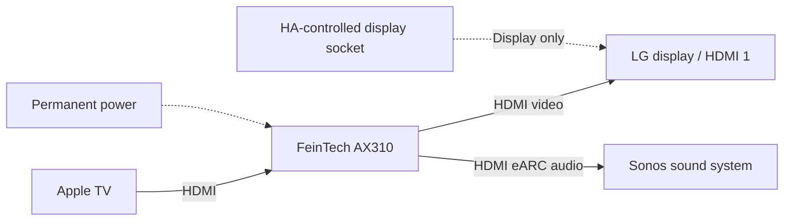

# Apple TV → FeinTech AX310 → LG display / Sonos

Since LG 2.0, all cross-device rules below are implemented by [AV Companion](https://github.com/mvs90/av_companion). The standalone LG integration controls the display only.

Installation topology supplied by the owner on 2026-10-02. The LG is a 75UH5F-HJ; this setup uses a **FeinTech AX310 HDMI 2.1 audio extractor for an eARC soundbar** because the display does not provide the required eARC connection. The exact Sonos model and AX310 EDID/CEC settings have not been recorded.

The AX310 is an **active, separately powered HDMI device**. It is not switched off by the display's smart plug. The extractor remains in the HDMI chain when the LG loses mains power. Configure the integration's power-supply switch to control **the LG only**, not the extractor or a common power strip for the chain. Apple TV and Sonos remain separately managed devices.

## Evidence and limits

[FeinTech's AX310 product documentation](https://feintech.eu/en/products/ax310-hdmi-2-1-audio-extractor-hdmi-earc) describes HDMI-source video passthrough to a display and audio output to an ARC/eARC soundbar, including use with a display that lacks eARC. Its EDID management is relevant when recording a reproducible installation.

**Owner observation:** disconnecting the display from mains can wake Apple TV from standby; with the permanently powered AX310 in this installation, Apple TV instead stays in standby. This was reported by the owner, not established through a new power-cut/A/B test by the integration project. Do not promote it to a guarantee for all Apple TV, extractor, cable, EDID, CEC or firmware combinations. The precise HDMI/CEC/handshake cause was not measured.

In particular, permanent extractor power does **not** establish that the LG always sees a valid video signal. Keep three observations separate: LG power/supply state, the signal actually reported at the LG input, and the state reported by the Apple TV integration. An active HDMI chain is not proof of active playback.

## Integration behaviour

- Apple TV remains the linked playback/remote target; Sonos remains the independent volume/announcement target. AX310 does not become a fake HA media player, power entity or standby sensor. No software-control interface for this extractor is implemented.
- Display standby is confirmed before switching off the **display-only** socket. Never infer a safe mains cut solely from Apple TV standby or a lack of HDMI signal.
- A confirmed linked `off`/`standby` state can shut down the display even when its HDMI input still reports a signal. The extractor's continued operation must not block this explicit standby evidence.
- Missing signal can independently confirm standby after the configured delay. Unknown signal is never treated as no signal. If Apple TV is incorrectly `idle` while the LG reports a valid signal, the current idle fallback remains blocked: this is ambiguous with a genuine Apple TV menu. Do not automatically disable signal checking just because an extractor is installed.
- A display-socket off event does not send wake/power commands to Apple TV, Sonos or the extractor. Repeated standby/idle attribute updates and polling are not wake intent. Explicit TV turn-on or an eligible genuine active-player transition can still wake the display under the normal automation policy.
- A consumption sensor used for standby evidence must measure **only the LG**, not the always-powered AX310 or the complete chain. Extractor consumption is not evidence of display or player activity.
- The physical HDMI path feeds Sonos from the external source. LG-native content audio is not automatically routed back through this arrangement: the LG lacks the required eARC return path. HA's independent Sonos audio announcements are a separate function.

No extractor-specific behavioural override is needed for the confirmed arrangement. Regression tests cover standby with a retained signal, display-only socket control and no player wake after the socket goes off. They verify the software policy, not the physical cause of Apple TV's HDMI behaviour.

## Acceptance checks for another installation

Record exact display, Apple TV, Sonos and extractor models/firmware, extractor EDID/CEC settings, HDMI ports and which devices the socket actually powers. With the owner ready for a power interruption, compare LG power and signal reports with Apple TV state before standby, after standby, after confirmed display standby followed by its socket going off, and after explicit wake. Check both correct Apple TV standby and the erroneous `idle` case. Observe extractor/soundbar power independently; leave unrelated music playback alone.

Do not run these disruptive checks just to collect routine inventory. Existing owner observations and bounded software tests are distinguished from newly performed hardware tests in the [LG device reference](LG-UH5F-H.md).
